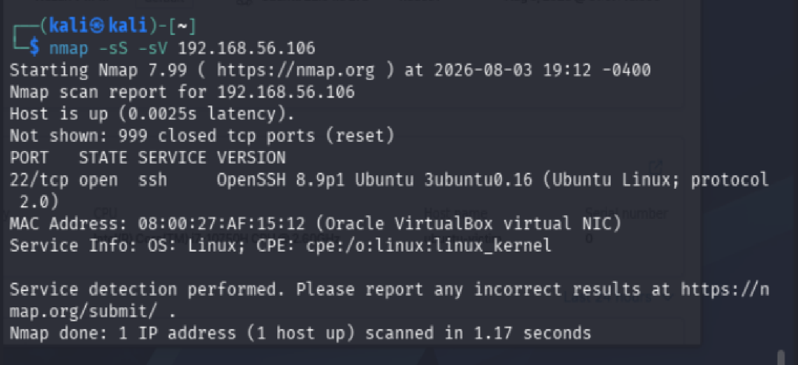
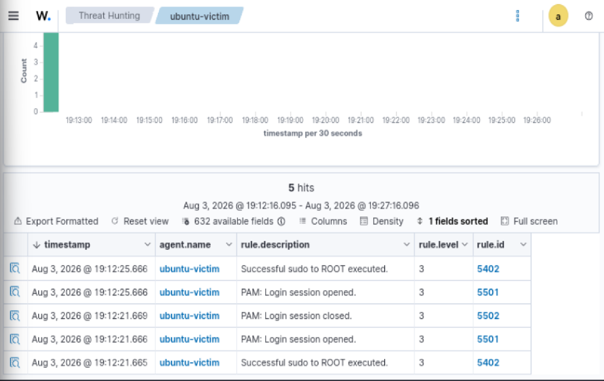
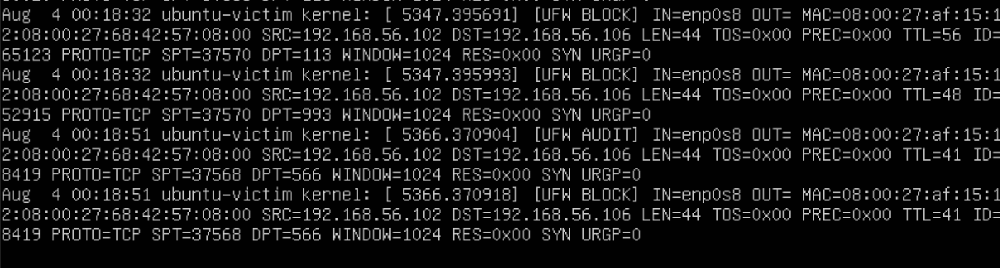
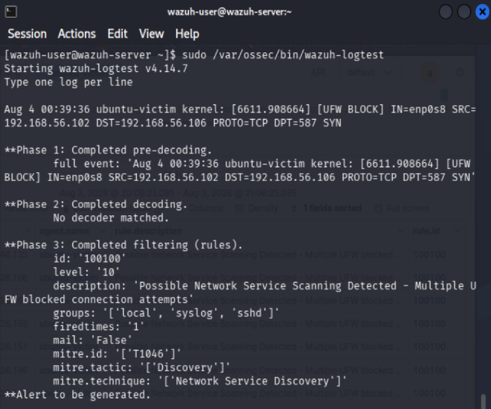
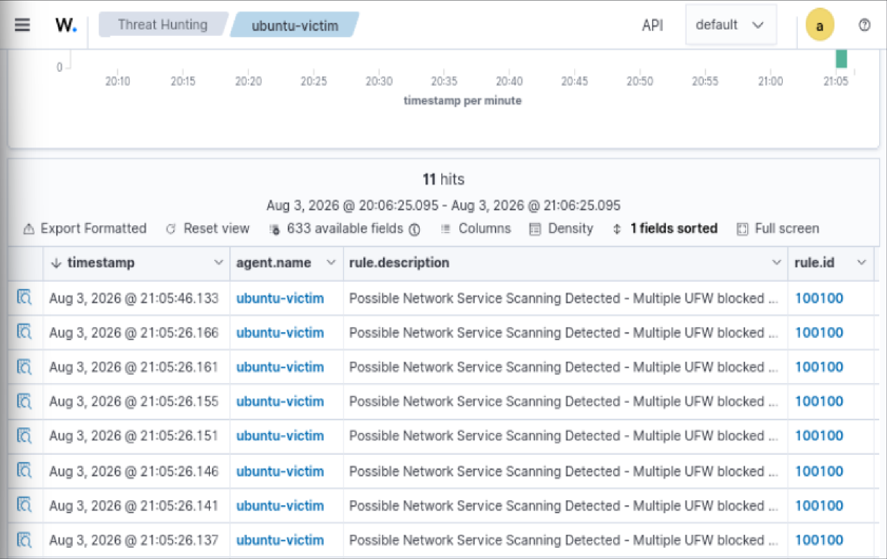

# Wazuh Detection Engineering: Network Service Scanning (MITRE T1046)

## Overview

This project demonstrates the design, implementation, and validation of a custom Wazuh detection rule for identifying adversary reconnaissance activity.

A Kali Linux VM was used to simulate attacker behavior by performing Nmap network service scans against an Ubuntu 22.04 endpoint monitored by Wazuh.

The investigation followed a detection engineering workflow:

1. Simulate adversary activity using MITRE ATT&CK techniques
2. Analyze available telemetry sources
3. Identify gaps in default SIEM detection coverage
4. Develop custom detection logic
5. Validate detection using Wazuh tooling
6. Investigate generated alerts as a SOC analyst

The final detection uses Ubuntu UFW firewall telemetry to identify blocked TCP connection attempts associated with network service scanning.

---

# Environment
## MITRE ATT&CK Mapping

| Technique | ID | Tactic |
|---|---|---|
| Network Service Scanning | T1046 | Discovery |

## Tools Used

| Tool | Purpose |
|---|---|
| Kali Linux | Adversary simulation |
| Nmap | Network reconnaissance |
| Ubuntu UFW | Firewall telemetry source |
| Wazuh SIEM | Detection and investigation |
| Wazuh Logtest | Rule validation |
---

# Phase 1 — Adversary Simulation

## Technique

**MITRE ATT&CK: T1046 — Network Service Scanning**

## Attack Simulation

A network reconnaissance scan was executed from Kali Linux:

```bash
nmap -sS -sV 192.168.56.106
```

## Result

The scan successfully identified exposed services on the Ubuntu endpoint.

| Port | Service | Version |
|---|---|---|
| 22/tcp | SSH | OpenSSH 8.9p1 |



---

# Phase 2 — Default Wazuh Detection Analysis

## Objective

Evaluate whether the default Wazuh deployment detects network reconnaissance activity.

## Findings

Following the Nmap scan, Wazuh Threat Hunting was reviewed.

Searches performed:

- Attacker IP
- Victim IP
- `nmap`
- `scan`

No alerts were generated for the reconnaissance activity.

Default Wazuh telemetry captured normal authentication activity but failed to identify the scanning behavior.



## Why Default Detection Failed

The default Wazuh ruleset successfully collected endpoint telemetry; however, network reconnaissance activity was not directly represented as a security alert.

The endpoint generated firewall events, but no correlation logic existed to identify repeated blocked TCP connection attempts from a single source.

This represents a common SIEM detection engineering challenge:

Telemetry collection ≠ Detection capability

Additional detection logic was required to transform raw firewall events into actionable security alerts.

---

# Detection Gap Identified

## Gap

The default Wazuh ruleset collected endpoint telemetry but did not detect network service scanning activity.

## Impact

An analyst relying only on default alerts would miss early-stage reconnaissance activity against the endpoint.

## Detection Requirement

A detection capability was required to identify:

- Multiple TCP SYN attempts
- Multiple destination ports
- Blocked firewall connections
- Source IP attribution

---

# Phase 3 — Detection Engineering

## Telemetry Source

Ubuntu UFW firewall logs were identified as the detection source.

Example event:

```
[UFW BLOCK] SRC=192.168.56.102 DST=192.168.56.106 PROTO=TCP DPT=443 SYN
```

The event showed:

- Source: Kali Linux (`192.168.56.102`)
- Destination: Ubuntu endpoint (`192.168.56.106`)
- Protocol: TCP
- Action: Firewall blocked connection



---

# Custom Wazuh Detection Rule

Rule location:

```
/var/ossec/etc/rules/local_rules.xml
```

Detection logic:

```xml
<rule id="100100" level="10">
  <match>UFW BLOCK</match>
  <description>
    Possible Network Service Scanning Detected - Multiple UFW blocked connection attempts
  </description>
  <mitre>
    <id>T1046</id>
  </mitre>
</rule>
```

The complete rule file is available:

```
rules/local_rules.xml
```
## Detection Logic Explanation

The rule monitors firewall-denied traffic collected from the Ubuntu endpoint.

When UFW generates blocked TCP connection events, Wazuh evaluates the event and generates a security alert mapped to MITRE ATT&CK T1046.

Detection flow:

Kali Linux
↓
Nmap SYN Scan
↓
Ubuntu UFW BLOCK Event
↓
Wazuh Agent Collection
↓
Custom Rule 100100
↓
Security Alert Generated
---

# Rule Validation

The rule was tested using Wazuh log testing:

```bash
sudo /var/ossec/bin/wazuh-logtest
```

The UFW event successfully matched:

```
Rule ID: 100100
Severity: Level 10
MITRE: T1046
```



---

# Phase 4 — Operational Validation

The Nmap scan was executed again:

```bash
nmap -sS -sV 192.168.56.106
```

The Wazuh dashboard generated alerts using the custom rule.



The validation confirmed that the custom detection closed the visibility gap identified during baseline testing.

---

# Phase 5 — Analyst Investigation

## Alert Evidence

Example alert fields:


Rule ID: 100100
Level: 10
MITRE Technique: T1046
Agent: ubuntu-victim
Source IP: 192.168.56.102
Destination IP: 192.168.56.106

## Alert Summary

| Field | Value |
|---|---|
| Detection | Possible Network Service Scanning Detected |
| Rule ID | 100100 |
| Severity | Level 10 |
| MITRE ATT&CK | T1046 |
| Source | Kali Linux |
| Target | Ubuntu Endpoint |

---

## Investigation Process

Reviewed:

- Source IP address
- Target endpoint
- Firewall telemetry
- Scanned ports
- Timeline correlation

The source IP was confirmed as the authorized Kali Linux testing VM.

---

# Analyst Assessment

Classification:

```
True Positive — Authorized Activity
```

The detection correctly identified behavior matching MITRE ATT&CK T1046. The activity was expected because it was generated during an authorized security testing exercise.

---

# Recommended Actions

For a production environment:

- Validate whether scanning activity is authorized
- Investigate unknown scanning sources
- Restrict unnecessary exposed services
- Monitor repeated scanning attempts
- Add correlation rules for high-volume reconnaissance

---

# Skills Demonstrated

- Wazuh SIEM administration
- Detection engineering
- MITRE ATT&CK mapping
- Linux firewall telemetry analysis
- SOC alert triage
- Network reconnaissance analysis
- Custom rule development
